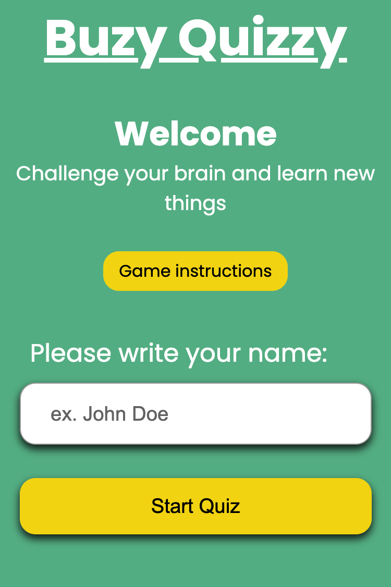
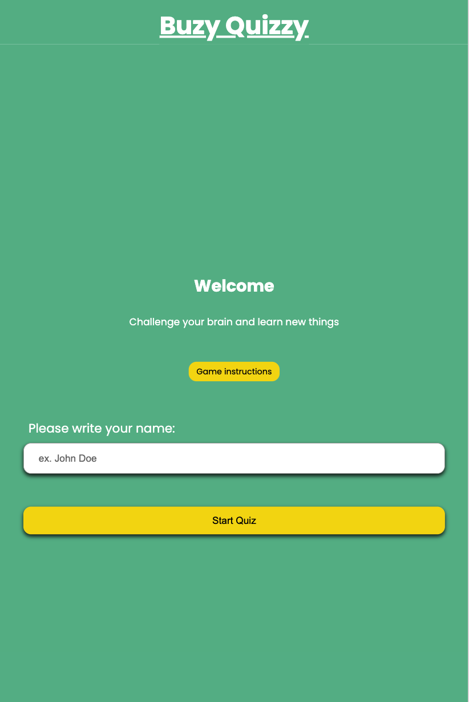
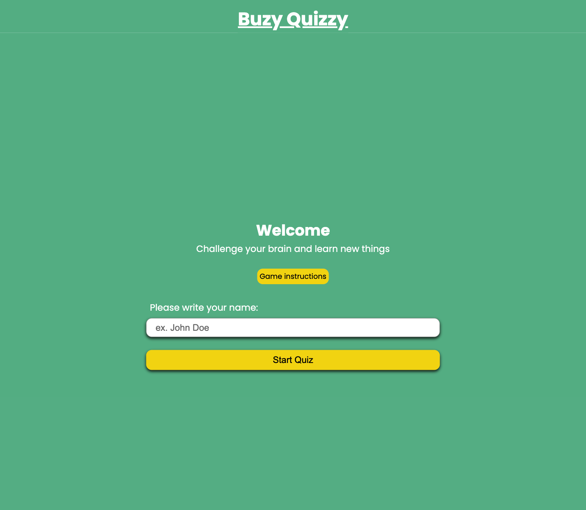

# Buzy Quizzy App

## Grupp 7
- Sara
- Antonio
- Stella
- William
- Aleksa

## Overview
This is an interactive quiz app where the user can be challenged with general questions and answer them with true or false answers. There are 10 different questions across various topics and the timer set to 10 seconds to each question. If the question is not answered on time, and the player will be transfered to next one, the answer be counted as false. The result is tracked through the quiz and it is displayed at the end of the game together with the leaderboard.

## Different screen size views

Click here to see the progress in KanBan:

### Smartphone view

### Touchpad view

### Desktop view

## Features
Welcome page:
Enter your name to start the quiz.
Instructions modal for explaining how the quiz work.
Game page:
Questions with True/False answers and the countdown timer.
Score is updating in real-time based on players answer.
Game Over page:
Displays the results.
Displays the leaderboard with top 5 players.
Leaderboard:
Saves the results locally.
Allows the player to clear it and/or start the quiz from beginning.
Responsive Design:
The quiz is optimised for desktop, tablet and mobile devices.
Instructions modal:
Guidance for users, explained step-by-step.
## Technologies Used
- HTML: For structuring the website.
- CSS: For styling and responsive design.
- Media Queries: For ensuring that the quiz works on different devices.
 - Google fonts: For adding external Fonts.
 - Javascript: For dynamic and interactive behaviour.
Local storage: For keeping the score and username.
## Advantages
Simple and clear design. The layout is easy to understand with the focus on the content.
Enkel och tydlig design: Layouten är enkel och lätt att förstå, med fokus på innehållet.
Responsive design: Quiz app works well on all devices, from mobile to desktop.
Semantic HTML: Helps search engines to understand the content.
## Disadvantages
Limited answers. Multiple answer-choice can be added.
## Future improvements
Add difficulty levels.
Add categories to choose.
Add more questions.
Add a progress bar.

## User Stories

## Design Skiss

